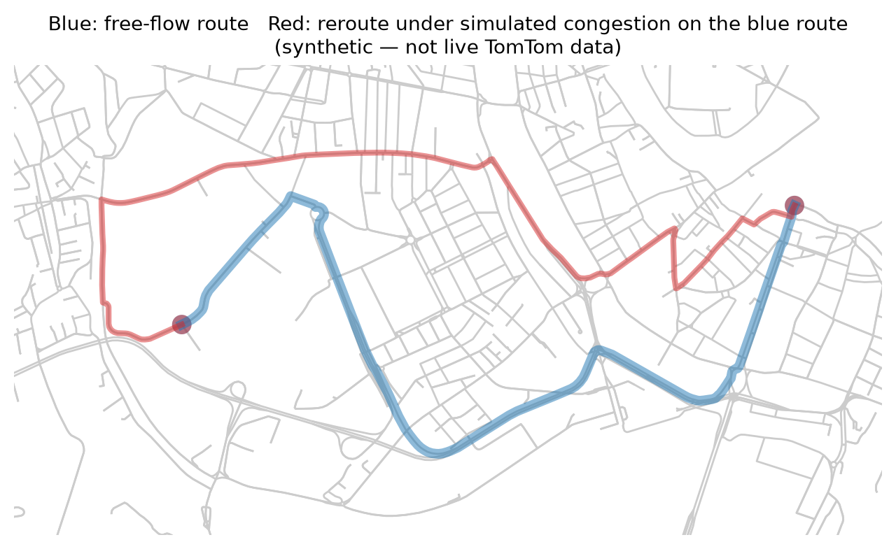

# Traffic-aware router

[](https://github.com/DavideFornari/traffic-aware-router/actions/workflows/ci.yml)



*Blue: free-flow shortest path. Red: the traffic-adjusted second pass reroutes once the blue
route's own edges are congested. This image uses simulated congestion, not live TomTom data (see
`scripts/generate_screenshot.py`) — with a real TomTom key, the same mechanism runs on real
traffic instead.*

A router that computes the best path between two points on a real road network, weighting edges
by both free-flow travel time and live traffic. Default area is Verona, Italy, but the area is
configuration — any OpenStreetMap place name or bounding box works.

This is a portfolio project focused on **modelling and algorithms**, not data plumbing: Dijkstra,
A*, and Yen's k-shortest-paths are implemented from scratch over a compact array-based graph
representation, with `networkx` used only as a correctness oracle in tests.

## Status

**All 8 milestones complete.** Graph loading and caching, Dijkstra/A*/Yen from scratch over CSR
arrays, the ellipse-bounded corridor, the TomTom traffic second pass, turn restrictions via a
line-graph adapter, and a Streamlit UI tying it all together — all runnable with no TomTom API key
at all. See the roadmap below for what shipped in each milestone, and Benchmarks for results.

## Try it

```bash
pip install -e ".[dev,viz,app]"
streamlit run app/main.py
```

First load downloads and caches the default area's road network (a minute or two); after that,
`streamlit run` is fast. No TomTom key needed to try it — the sidebar has an optional field for
one, or copy `.env.example` to `.env` and it's picked up automatically (see Development below).

## Modelling assumptions

- **Static snapshot model.** Traffic is sampled once, when the route is requested, and edge
  weights are fixed during the search. This is not time-dependent routing.
- **Free-flow time, not length, is the base metric.** Minimising metres returns implausible
  back-street routes and excludes fast roads from the search corridor.
- All geometric reasoning (ellipse, buffers, matching) happens after projecting to a local metric
  CRS (UTM zone of the area), never in raw lat/lon degrees.
- **Non-negative edge weights.** Travel times are never negative, which is what makes a
  lazy-deletion binary-heap Dijkstra correct (see `router/core/dijkstra.py`) instead of requiring
  Bellman-Ford.

`CLAUDE.md` has the full project brief this was built from. Every other mathematical assumption —
the ellipse containment bound, A* admissibility (twice: once for the node graph, once again for
the line graph's head-node rule), the traffic-matching bearing check — is stated in a docstring at
the point it's relied on, and repeated in the relevant section below.

## Architecture

The routing core is graph-agnostic: it never sees OSM, networkx, or TomTom directly. Adapters
convert OSM graphs (and, later, a line graph for turn restrictions) into CSR-style arrays that
the core algorithms operate on.

```
src/router/core/       routing algorithms (Dijkstra, A*, Yen) over CSR arrays
src/router/graph/      OSM download, caching, adapters, line graph
src/router/traffic/    TomTom client, matching, cache
src/router/corridor/   ellipse bound, k-paths, subgraph extraction
app/                   Streamlit UI
```

`src/router/graph/` currently provides:

- `AreaConfig` / `verona()` — the area to route on (OSM place name or bbox), never hardcoded
  past this config object.
- `load_graph` — downloads via osmnx and caches the raw extract to disk as GraphML, keyed by a
  hash of the area config, so repeat runs are instant and offline.
- `prepare_graph` — projects to the area's UTM zone and imputes free-flow speeds/travel times via
  `osmnx.add_edge_speeds` / `add_edge_travel_times`. Missing `maxspeed` is filled with the mean
  speed per highway type, which is optimistic for residential streets.
- `build_csr` — converts any weighted `networkx.MultiDiGraph` (OSM-derived or hand-built) into
  the CSR arrays (`indptr`, `indices`, `weights`) the routing core will operate on; parallel
  edges collapse to their minimum-weight edge.

A small extract around Piazza Bra, Verona (`tests/fixtures/verona_center.graphml`, 66 nodes, 126
edges, © OpenStreetMap contributors, ODbL) is committed as a test fixture and exercised
end-to-end by the golden tests.

### Turn restrictions (`src/router/graph/restrictions.py`, `line_graph.py`)

OSM encodes a banned turn as a `type=restriction` relation between a `from` way, a `via` node (or
way), and a `to` way — a relation between ways, not a property of any single edge — and osmnx
doesn't fetch or apply these.

- `fetch_turn_restrictions` — queries Overpass directly for `type=restriction` relations within a
  bounding box (`graph_bbox` derives it from the downloaded graph's own node extent, so
  restrictions always cover exactly the area actually routed on, regardless of whether the graph
  was fetched by place name or bbox).
- `resolve_restrictions` — maps each relation's `from`/`via`/`to` members onto concrete edges of a
  specific graph, by finding the edge whose `osmid` matches the `from`/`to` way and which is
  incident to the `via` node. Restrictions via a *way* (rather than a node) are skipped —
  resolving them would need splitting that way into the specific edge sequence the relation
  implies, which this project doesn't attempt — and so is any restriction whose way or node isn't
  found in the graph at all (osmnx can simplify, merge, or drop what a relation refers to). Both
  are documented limitations, not silent gaps: an unresolved restriction is never enforced, but
  it's also never silently misapplied to the wrong edge.
- `build_line_graph` — the adapter. Each line-graph node is a directed real edge; each line-graph
  edge is a maneuver from one real edge to the next through the node they share. A banned turn is
  simply an absent arc; an `only_*` restriction removes every *other* arc leaving its via node for
  the given `from` edge; a turn penalty (e.g. for U-turns, demonstrated via `u_turn_penalty_s`) is
  extra cost on an arc. **The routing core is completely unchanged by this** — `build_line_graph`
  produces an `nx.MultiDiGraph` that goes through the exact same `build_csr` as the node graph;
  Dijkstra and A* never know the difference.
- **The A* heuristic head-node rule.** Each line-graph node keeps its real edge's *head* node's
  coordinates (where the edge ends), not its tail or a midpoint — because that's where you
  physically are once you've finished traversing the edge, which is exactly where the heuristic
  must be anchored to stay admissible: the remaining cost from wherever the search currently
  stands can't be less than the straight-line distance from *there* to the destination divided by
  `v_max`.
- **Cost accounting.** An arc costs its destination edge's own travel time (the cost of *entering*
  it); a route's very first edge is never entered via an arc, so a line-graph Dijkstra/A* distance
  is the true route cost *minus* the source edge's own weight. `source_edge_weight` gives that
  back, for a total comparable to a node-graph Dijkstra between the same two real nodes.

- `route_on_line_graph` — a line graph has no notion of "the origin" or "the destination", only
  directed real edges, so point-to-point routing means any edge leaving the origin is a valid
  first move and any edge arriving at the destination is a valid last move: a multi-source,
  multi-target search. Implemented as a *single* ordinary Dijkstra run on the unmodified core: a
  virtual super-source node is appended to the line graph's CSR arrays with an edge to every
  candidate first move, weighted by that edge's own travel time (which is what `source_edge_weight`
  would otherwise need adding back afterwards — here it's baked into the search instead); the best
  of every candidate last move's distance is the answer, no super-sink needed.

Tested with unit tests on hand-built junctions (bans, `only_*` restrictions, U-turn penalties,
`route_on_line_graph`'s multi-source/multi-target search), a `hypothesis` property test proving an
*unrestricted* line graph reproduces the exact same cost as computing the same route directly on
the node graph (the oracle, as elsewhere in this project — checked twice: once per real edge pair,
once for `route_on_line_graph` against plain node-graph Dijkstra directly), and golden tests on the
Verona fixture.

**Wired into routing** (`src/router/corridor/restricted_second_pass.py`): `app/main.py` fetches
and resolves restrictions once per area (degrading to no restrictions, not a crash, if Overpass is
unreachable — the same resilience pattern as the no-TomTom-key path), and the traffic-aware second
pass builds a line graph from just the corridor's (traffic-adjusted) edges and routes on it via
`route_on_line_graph`. The free-flow first pass deliberately stays on the plain node graph — it
only exists to cheaply bound the corridor, not to be a final answer, and turn-restriction-aware
routing is strictly more expensive — so the two routes can, correctly, disagree about which turns
are legal; the UI says so explicitly rather than leaving it a silent inconsistency. If every route
within the corridor is blocked by a restriction (possible with a tight corridor), the second pass
falls back to the unrestricted route rather than a dead end.

Line graph size and cost vs the node graph, and how many real restrictions actually resolve, are
in the [Benchmarks](#benchmarks) section below.

`src/router/core/` provides:

- `dijkstra` — single-source shortest path over CSR arrays with a binary heap. Assumes
  non-negative edge weights (stated in the docstring, since that assumption is exactly what
  makes lazy-deletion Dijkstra correct instead of requiring Bellman-Ford).
- `astar` — same search, guided by `heuristic(u) = great_circle_distance(u, target) / v_max`.
  Admissible because no travel-time path can beat covering the remaining straight-line distance
  at the fastest speed anywhere in the graph, so the heuristic never overestimates true remaining
  cost.
- `reconstruct_path` — turns a predecessor array back into a node sequence.

Correctness is checked two ways: `hypothesis`-generated random directed graphs compared against
`networkx.single_source_dijkstra_path_length` (Dijkstra), and against a construction where every
edge weight is `distance / speed` with `speed <= v_max` — which guarantees the A* heuristic is
admissible by the triangle inequality on great-circle distance, so A*'s cost must equal
Dijkstra's (A*); plus golden tests running both algorithms on the committed Verona fixture.

Benchmarked against networkx in the [Benchmarks](#benchmarks) section below.

`src/router/core/` also provides `yen_k_shortest_paths` — Yen's algorithm for the k shortest
loopless paths, built entirely on `dijkstra`. "Removing" a node or edge for a spur search needs no
change to `dijkstra` itself: it's done by copying the weight array and setting the relevant
entries to infinity, which `dijkstra` already treats as "no edge". Checked against
`networkx.shortest_simple_paths` (matching costs for the k cheapest loopless paths; ties can
break differently between implementations, so costs — not paths — are compared) and against a
golden test on the Verona fixture.

### Corridor (`src/router/corridor/`)

Implements CLAUDE.md's "corridor" step of the two-pass design: a full-graph Dijkstra bounds an
ellipse, Yen then runs only on the (much smaller) ellipse subgraph, and the buffered union of its
k paths is folded back in.

- `ellipse_l_max(t_star, epsilon, v_max)` — the major-axis bound `(1 + epsilon) * t_star *
  v_max`. Any route with free-flow time up to `(1 + epsilon) * t_star` covers at most this many
  metres, since no edge exceeds `v_max` (time bounds distance). Deliberately sized from the
  *time* budget, not `(1 + epsilon)` times the shortest *distance* — a time-optimal route (e.g. a
  ring road) can be far longer in metres than the distance-shortest path, so a distance-based
  bound could wrongly exclude it. `v_max` (`graph/prepare.py::max_speed_kph`) is the fastest speed
  limit anywhere in the *whole loaded graph*, not just near this trip — necessarily so, since the
  bound has to stay valid for a hypothetical route that does detour onto that faster road. For an
  area extract that includes a motorway, this makes the ellipse loose (and the corridor
  correspondingly large) for ordinary in-town trips that never go near it: on Verona's own
  extract, a stretch of the A4 ("Autostrada Serenissima", 130 km/h) sets `v_max` for every route,
  even a 2.8 km in-town trip whose own streets top out around 50 km/h — a real, measured instance
  of this pulled in 20% of the graph's nodes and produced 2,832 traffic-sampling probes for what
  should have been a small corridor. A deliberate soundness-over-tightness tradeoff, not a bug.
- `in_ellipse` — the focal definition of an ellipse (sum of distances to the two foci at most
  `l_max`) applied directly to projected node coordinates, needing no center, rotation, or
  semi-axis lengths.
- `extract_subgraph` — induced sub-CSR from a boolean node mask, with the index remapping back to
  the full graph, used first to restrict Yen to the ellipse and then to build the final corridor.
- `buffered_path_union` / `nodes_in_polygon` — a `shapely` buffer around the union of Yen's k
  paths, and a vectorised (`shapely.contains_xy`) test for which full-graph nodes it covers —
  this is what recovers a parallel street one block over that the ellipse alone would miss.
- `build_corridor` — wires the above into one call: first-pass Dijkstra for `t_star`, ellipse
  subgraph, Yen on it, buffer union, final corridor subgraph. Also returns the ellipse mask and
  buffer polygon for debugging.

Tested with unit tests on hand-built geometry/graphs for each piece, plus a golden test running
the full pipeline on the Verona fixture. `scripts/debug_corridor.py` (needs the `viz` extra: `pip
install -e ".[viz]"`) renders the corridor on an interactive map — candidate paths, the corridor
subgraph (coloured by whether the ellipse or the buffer pulled a node in), and the buffer polygon
— since this geometry is exactly the kind of thing that's easy to get subtly wrong (wrong CRS, an
inverted containment test) in a way unit tests on synthetic coordinates can miss.

### Traffic (`src/router/traffic/`)

The endpoint, its parameters, and the free tier were checked against TomTom's live docs before
writing any client code, not assumed:

- **Endpoint:** `GET https://api.tomtom.com/traffic/services/4/flowSegmentData/{style}/{zoom}/json
  ?key=...&point={lat},{lon}&unit=kmph`, returning `currentSpeed`, `freeFlowSpeed`,
  `roadClosure`, and the matched segment's own polyline (`coordinates.coordinate[]`).
- **Free tier:** 20,000 requests/month, no credit card required (docs.tomtom.com/pricing,
  checked at implementation time — TomTom can change this, so reverify before relying on it).

Modules:

- `TomTomClient` — wraps the endpoint above. Reads `TOMTOM_API_KEY` from the environment if no
  key is passed explicitly. **With no key, every call is a no-op returning `None`** — this is
  where CLAUDE.md's hard constraint (the app must run without a TomTom key) is actually enforced;
  everything downstream already treats "no traffic data for this edge" as the normal case.
- `sample_probe_points` — places one probe per ~300m of corridor length (default; configurable),
  at edge midpoints, rather than once per OSM edge — a city-scale corridor can have thousands of
  edges, and the free tier is 20,000 requests/month. Deduplicates a two-way street's forward/
  backward edges into a single probe first.
- `edge_matches_segment` — the fiddliest, least visible part of this project (per CLAUDE.md).
  Requires both a buffered geometric overlap *and* a bearing check (reject if the edge's and the
  segment's directions differ by more than ~30 degrees, default). The bearing check specifically
  exists to catch **opposite-carriageway assignment**: a dual carriageway's two directions run a
  few metres apart, so distance alone can't tell them apart, but their directions are ~180
  degrees apart, easily caught by bearing. Compares against the segment's *local* bearing —
  `local_bearing_deg` projects the edge's midpoint onto the polyline and uses just the nearest
  pair of vertices' direction — not its overall start-to-end bearing, which can be badly wrong for
  a long or curved TomTom segment (e.g. one that runs east past the queried edge, then bends
  north: the overall bearing is ~45 degrees northeast, agreeing with neither leg). Documented (but
  *not* handled — flagged as a real limitation) failure mode: **vertically stacked roads**
  (bridges/underpasses), which look identical in this 2D matching regardless of buffer or bearing.
- `TrafficCache` — TTL cache (default 5 minutes) keyed by projected coordinates quantised to a
  ~50m grid, so overlapping corridors or repeat queries reuse probes instead of spending quota.
- `apply_traffic` — the second pass: samples the corridor, fetches/matches each probe, and
  returns a copy of the corridor's weights with matched edges scaled by `free_flow_speed /
  current_speed`. Deliberately resilient at every step — no key, a bad response, a network error,
  an expired key, or a rejected match all just leave that edge at its free-flow weight rather than
  raising, so a route is always produced even when traffic data is partly or wholly unavailable.

Other documented error modes (not specific to the bearing check): a TomTom segment spanning
several short OSM edges, or several TomTom segments covering one long OSM edge — either can leave
a queried edge only partially represented by its match.

Tested with unit tests per module (including the bearing/buffer boundary cases directly), a fully
mocked-HTTP client test suite (no real network calls), and a golden test running the whole second
pass on the Verona fixture's corridor with a fake "always congested" client, asserting the
traffic-aware route is never faster than free-flow.

### UI (`app/`)

`app/main.py` is the Streamlit entry point; `app/helpers.py` holds every piece of logic that
doesn't touch `st.*` or `folium.*` directly (endpoint snapping, duration formatting, the
traffic-status message, a CSR position → source-node lookup for highlighting matched edges), kept
separate specifically so it's unit-testable without a running Streamlit session.

- **Origin/destination**, three ways: click the map (a one-use "Pick origin…"/"Pick destination…"
  button arms which point the *next* click sets, then deactivates itself automatically — so the
  map can be freely panned and zoomed afterwards without risk of moving the point again), type a
  place name and hit Search (geocoded via `osmnx`/Nominatim), or paste `lat, lon` directly.
- **Snapping to the road, not the nearest intersection.** A typed address or a click usually
  lands mid-block — the nearest *intersection* to that point is frequently not the intersection
  you'd actually leave from. `nearest_edge_endpoints` (`ox.distance.nearest_edges`, R-tree backed,
  using the road's true geometry) finds the edge the point actually sits on and returns both
  endpoints as an `EdgeSnap`. osmnx collapses any chain of degree-2 nodes into a single graph
  edge regardless of length or of the street name changing partway through — a merged edge can
  run hundreds of metres, e.g. a street that continues across a bridge under a different name, so
  *both* endpoints can be far from the query point, in different directions. `EdgeSnap` projects
  the query point onto the edge's own geometry and splits its travel time proportionally,
  producing a real *approach cost* for each endpoint instead of assuming both are free to reach.
  `select_best_endpoints` then picks whichever of the (up to four) origin×destination combinations
  gives the cheapest **total** trip — approach + route + approach — not whichever is geometrically
  closer or has the cheapest route alone, since those can each disagree with the true total (a
  farther-to-reach node can still win if its route is enough cheaper, and that can be the
  genuinely correct answer, e.g. a route that legitimately crosses a bridge immediately). Only two
  full-graph Dijkstra runs are needed (one per origin candidate; `target=None` covers both
  destination candidates per run), not four. The reported ETA includes the winning approach cost
  too (a caption discloses it when non-trivial), and a dotted grey connector — following the
  snapped edge's real geometry, not a straight line — is drawn from the pin to wherever the route
  actually starts/ends, so a long merged edge is drawn crossing the bridge it represents rather
  than leaving an unexplained gap between the pin and the route. Applies to both origin and
  destination, across all three input methods above. `nearest_node` (plain nearest-intersection
  snapping, no approach cost) is kept for callers that just need a quick, good-enough node for a
  fixed point, e.g. the debug/benchmark scripts' hardcoded coordinates.
- **Comparison**: free-flow ETA, traffic-aware ETA, and the delta, plus both routes drawn on one
  map (solid blue vs dashed red) so the two are visually easy to tell apart. The traffic-aware
  route also respects turn restrictions (see "Turn restrictions" above); a caption says so, and
  says when it doesn't (every route in the corridor blocked by a restriction — rare, but handled).
- **Corridor and live-data layers**: toggleable via the map's layer control, same idea as
  `scripts/debug_corridor.py` — the corridor subgraph the search actually considered, and which of
  its edges got real TomTom data (the rest silently kept their free-flow weight).
- **No-key fallback, visibly**: with no TomTom key, a warning banner says so and both routes are
  identical, rather than the app silently pretending it had traffic data.
- **Results persist across reruns**: computing a route resolves everything to plain data in
  `st.session_state`, rendered by a function that runs on every rerun — not just the one where
  "Compute route" was clicked — so moving a map pin or tweaking a slider afterwards doesn't wipe
  the comparison off the screen.

Verified by actually running the app — `streamlit.testing.v1.AppTest` executes `app/main.py`
server-side (the officially supported way to test a Streamlit script without a browser) and was
used to drive the golden path end-to-end: load the default area, click "Compute route", confirm
zero exceptions, correct ETAs, and the expected no-key warning; the same-origin/destination error
path, confirming it fails cleanly rather than crashing; and a real geocoded-address search
end-to-end, confirming the resolved point actually reaches the compute step. The edge-snapping fix
itself has a golden test that reproduces the original bug report directly: on the Verona fixture's
longest edge (a ~230m block of merged street names), `nearest_node` picks an intersection that is
neither of that edge's own endpoints, while `nearest_edge_endpoints` correctly finds both and
prices a real, non-zero approach cost to each.

The approach-cost/connector fix was verified against the exact real-world case that motivated it:
querying the actual geocoded coordinates of an address on a ~650m osmnx-merged edge that crosses
Ponte della Vittoria in Verona (part "Corso Cavour", part the bridge itself, part two more streets
on the far bank) confirmed the interpolation splits the edge's travel time correctly between its
two ends, and that a route genuinely can be cheaper via the far side of a bridge crossing — in
that case the fix's job isn't to force the "near" endpoint, it's to make sure the far endpoint was
chosen for a real cost reason and that the drawn connector actually shows the bridge crossing
instead of leaving a gap on the map.

## Benchmarks

All numbers below are from the full Verona network (41,460 nodes, 91,074 edges), reproducible via
the scripts named in each section — none of this is committed data, it's all downloaded/cached
and computed fresh.

### Routing core: our Dijkstra/A* vs networkx

`scripts/benchmark_core.py`, 20 random origin/destination queries:

| Algorithm | Mean wall time (ms) | Mean settled nodes |
|---|---|---|
| networkx Dijkstra | 36.5 | n/a |
| Our Dijkstra (CSR) | 13.8 | 17,005 |
| Our A* (CSR) | 15.4 | 9,608 |

Our Dijkstra is ~2.6x faster than networkx's, not the 10–50x CLAUDE.md's architecture notes
anticipate — both implementations are pure Python, so a hand-rolled `heapq` loop saves networkx's
object-graph overhead but doesn't escape Python's per-operation cost. A* settles roughly half the
nodes Dijkstra does (the admissible heuristic prunes the search well) but isn't faster in wall
time here: haversine/trig calls per heap push are expensive enough in pure Python to offset the
work saved. A C-level implementation (numpy-vectorised or `scipy.sparse.csgraph`) would very
likely close both gaps; documented here rather than papered over, since being able to explain a
benchmark's limits is as important to this project as the number itself.

### Corridor: how much of the graph a query actually touches

For the default screenshot query (Piazza Bra to Stadio Bentegodi, `epsilon=0.3`, `k=4`), the
corridor is 8,446 of 41,460 nodes — about 20% of the city. That's the entire point of the two-pass
design: Yen and the traffic second pass only ever run on that 20%, not the full graph, however
large the epsilon or however far apart origin and destination are (`scripts/debug_corridor.py`
renders exactly this for any query).

### Line graph: turn restrictions' node-count and timing cost

`scripts/benchmark_line_graph.py`, fetching real restrictions and building both graphs:

```
Node graph:  41,460 nodes, 91,074 edges
Line graph:  91,758 nodes, 230,003 edges  (2.21x the node count)
Fetched 5,670 restriction relations, resolved 2,559 to graph edges (45%)
```

| Graph | Algorithm | Mean wall time (ms) |
|---|---|---|
| Node graph | Dijkstra | 13.5 |
| Line graph | Dijkstra | 38.4 |
| Line graph | A* | 44.8 |

The node-count ratio (2.2x) is lower than CLAUDE.md's architecture notes anticipated (3-4x) —
Verona's street network is dense enough that its average node degree is higher than that estimate
assumed, so each node's out-edges (which become line-graph nodes) are fewer relative to the node
count than in a sparser network. Dijkstra on the line graph takes ~2.8x as long as on the node
graph, roughly tracking its larger size; A* doesn't recover its usual settled-node advantage here
for the same pure-Python overhead reason noted above. The ~45% restriction-resolution rate
reflects real via-way restrictions (skipped, see the turn-restrictions section) and relations
referring to ways/nodes osmnx simplified away — not a bug, but worth knowing before trusting turn
restrictions are fully enforced on any given network.

## Development

```bash
make venv    # create .venv and install the project with dev dependencies
make lint    # ruff check + format check
make test    # pytest
make format  # ruff format + autofix
```

The app will run without a TomTom API key: with no key it falls back to free-flow-only routing
and says so in the UI. To enable live traffic without pasting a key into the sidebar every
session, copy `.env.example` to `.env` and fill in a free key (developer.tomtom.com — no credit
card required); `app/main.py` loads it via `python-dotenv` (part of the `app` extra) at startup.
`.env` is gitignored — **never commit a real key or a `.env` file**; `.env.example` is the
committed template. A sidebar toggle switches between the environment/`.env` key and pasting one
in for just that session (disabled automatically if no `TOMTOM_API_KEY` is found anywhere).

## Licences

Code is MIT-licensed (see `LICENSE`). Road network data comes from OpenStreetMap and is
licensed under the Open Database License (ODbL) — © OpenStreetMap contributors,
https://www.openstreetmap.org/copyright. Live traffic data, when available, comes from the
TomTom Traffic API and is subject to TomTom's terms of use.

## Roadmap

All 8 milestones are complete:

1. ✅ Scaffolding
2. ✅ Graph layer — OSM download, caching, CSR adapter, test fixture
3. ✅ Routing core — Dijkstra, A*, hypothesis + golden tests, benchmark
4. ✅ Corridor — ellipse bound, Yen on the ellipse subgraph
5. ✅ Traffic — TomTom client, probe sampling, matching, second pass
6. ✅ Turn restrictions — line graph, turn penalties
7. ✅ UI — Streamlit map with free-flow vs traffic-aware comparison
8. ✅ Documentation and benchmarks *(this milestone)*

### Known limitations / possible future work

Documented rather than hidden, since knowing a system's edges is part of being able to defend it:

- **Time-dependent routing.** Traffic is a static snapshot at query time (see Modelling
  assumptions) — no prediction of conditions at actual arrival time along the route.
- **Vertically stacked roads** (bridges/underpasses) are indistinguishable from the road below
  them in the 2D traffic matching (see Traffic).
- **Via-way turn restrictions** aren't resolved, only via-node ones (see Turn restrictions).
- **City-scale only.** A full-graph Dijkstra per query is fine at Verona's size; a contraction
  hierarchy or similar speedup structure would be the next step at a much larger scale (documented
  as the known scaling path, not built, per CLAUDE.md's scope for this project).
- **Pure Python.** The core algorithms trade the 10-50x speedup a compiled implementation could
  give for readability and ease of testing/defending in an interview — a deliberate choice for a
  portfolio project, not an oversight (see Benchmarks).
- **Geocoding is only as precise as Nominatim's match.** `nearest_edge_endpoints` correctly finds
  the road under whatever point it's given, but a short, generic search string (e.g. a street name
  with no city/postcode) can resolve to a same-named street in a different town entirely — that's
  a Nominatim query-specificity issue upstream of anything this project controls, not a snapping
  bug. Include the postcode or "città" for an unambiguous match.
- **Endpoint snapping still routes from one of the nearest road's two intersections**, not the
  exact mid-block point (splitting the edge and inserting a real virtual node there — Option A in
  the design discussion — would be exact, at the cost of mutating the CSR arrays per query). The
  approach-cost/connector fix makes the *time estimate and the map* honest about this (both
  endpoints are priced and drawn instead of assumed free), but the underlying route still runs
  node-to-node; the "last mile" approach is an interpolated straight-through-the-edge estimate,
  not a routed path of its own (irrelevant in practice, since it's a single edge with nowhere else
  to go, but worth stating precisely).
- **Approach-cost interpolation assumes uniform speed along the whole merged edge.** A 650m edge
  that's mostly a fast bridge crossing plus a short slow residential stretch gets its travel time
  split by *distance*, not by how that speed actually varies along the way — a coarser
  approximation for long, heterogeneous merged edges than for short, uniform ones.
